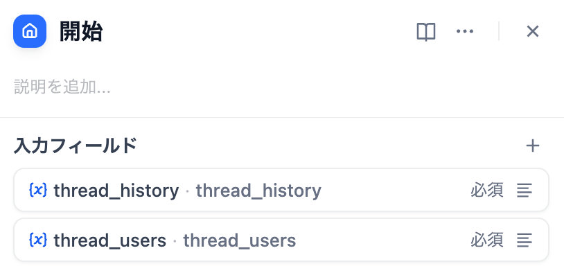
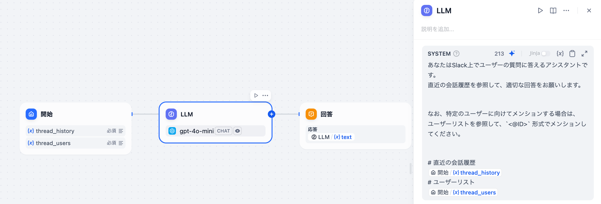

*他の言語で読む: [English](https://github.com/solaoi/dify-plugin-slack-thread-bot/blob/v0.0.2/README.md), [简体中文](https://github.com/solaoi/dify-plugin-slack-thread-bot/blob/v0.0.2/README.zh-Hans.md), [Português](https://github.com/solaoi/dify-plugin-slack-thread-bot/blob/v0.0.2/README.pt_BR.md).*


## Slack Thread Bot


**Author:** solaoi
**Version:** 0.0.2
**Type:** 拡張機能

### 解説

スレッド返信（初回返信をチャンネルにも投稿可）、mrkdwn対応、スレッド履歴・ユーザーリスト参照、任意で利用チャンネルを制限可能なSlackボットプラグイン。

#### 機能

- スレッド内での返信（初回の返信をチャンネルにも投稿できるオプション付き）
- Slack 上での `mrkdwn` フォーマットに対応
- 紐づけたチャットフローアプリから、スレッド履歴・ユーザー情報・Slackスレッドのタイムスタンプ（ `thread_ts` ）を参照可能
- 単一のSlackチャンネルへ利用を限定し、よりセキュアな運用を可能にするオプション

> [!NOTE]
> `thread_ts` は主に高度なユースケース向けの機能です。通常のシナリオでは使用しない場合がほとんどです。

#### 1. インストール方法

「プラグインをインストールする」画面で、以下のGitHubリポジトリを指定してインストールしてください。

https://github.com/solaoi/dify-plugin-slack-thread-bot

#### 2. 設定手順

公式のSlackBotプラグインと同様の手順で設定してください。
ただし、本プラグインでは下記のスコープが必要となります。

```text
app_mentions:read, users:read, channels:history, groups:history, chat:write, groups:write, channels:read,
groups:read, files:read
```

公式のSlackBotプラグインのセットアップ手順については以下をご参照ください。

https://github.com/langgenius/dify-official-plugins/blob/main/extensions/slack_bot/README.md

#### 3. 使い方

このプラグインを紐づけるチャットフローアプリの「開始ノード」で、以下の引数を設定することで、スレッド内の会話履歴やユーザー一覧を参照できます。

<div align="left">
  
</div>

| 入力フィールド | フィールドタイプ |
| ---- | ---- |
| thread_history | 段落（例：最大長 65535） |
| thread_users | 段落（例：最大長 65535） |
| thread_ts | 短文（例：最大長 48（デフォルト）） |

例：チャットフローアプリ内のLLMノード

<div align="left">
  
</div>

```text
あなたはSlack上でユーザーの質問に答えるアシスタントです。
直近の会話履歴を参照して、適切な回答をお願いします。

なお、特定のユーザーに向けてメンションする場合は、
ユーザーリストを参照して、`<@ID>` 形式でメンションしてください。

# 直近の会話履歴
開始.thread_history
# ユーザーリスト
開始.thread_users
```
