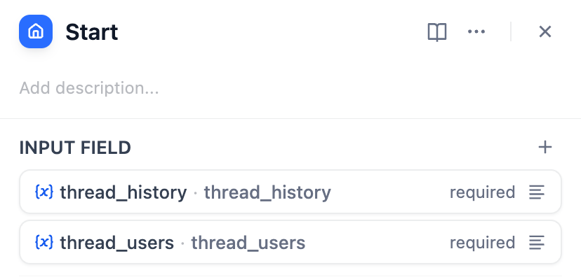
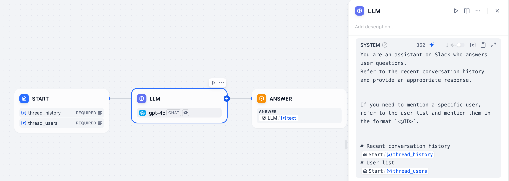

*Read this in other languages: [日本語](https://github.com/solaoi/dify-plugin-slack-thread-bot/blob/v0.0.2/README.ja.md), [简体中文](https://github.com/solaoi/dify-plugin-slack-thread-bot/blob/v0.0.2/README.zh-Hans.md), [Português](https://github.com/solaoi/dify-plugin-slack-thread-bot/blob/v0.0.2/README.pt_BR.md).*


## Slack Thread Bot


**Author:** solaoi
**Version:** 0.0.2
**Type:** extension

### Description

Slack bot plugin for thread replies (optionally posting the first reply to the channel), Slack file uploads, mrkdwn formatting, referencing thread history and user list, and optional usage channel restriction.

#### Features

- Reply within Slack threads (with an optional setting to also post the first reply in the channel)
- Slack file uploads (automatically passed to a linked app)
- Support for Slack `mrkdwn` formatting in replies
- Access to thread conversation history, user information, and Slack thread info (`channel_id`, `thread_ts`) from a linked app
- Optional restriction to a single Slack channel for more secure usage

> [!NOTE]
> The `channel_id` and `thread_ts` are primarily provided for advanced use cases. In most scenarios, you likely won't need to use them.

#### 1. Install

To install this plugin, specify the following GitHub repository when selecting "Install Plugin":

https://github.com/solaoi/dify-plugin-slack-thread-bot

#### 2. Setup

Follow the same setup procedure as the official SlackBot plugin.
However, this plugin requires different scopes:

```text
app_mentions:read, users:read, channels:history, groups:history, chat:write, groups:write, channels:read,
groups:read, files:read
```

For details on how to set up the official SlackBot plugin, see:

https://github.com/langgenius/dify-official-plugins/blob/main/extensions/slack_bot/README.md

#### 3. How to use

In the start node of the chat flow app that you link to this plugin, you can reference the conversation history and the list of users in the thread using the following arguments:

<div align="left">
  
</div>

| INPUT FIELD | FIELD TYPE |
| ---- | ---- |
| thread_history | Paragraph, Max length (e.g., 65535) |
| thread_users | Paragraph, Max length (e.g., 65535) |
| files | File List |
| thread_ts | Short Text, Max length (e.g., 48: Default) |
| channel_id | Short Text, Max length (e.g., 48: Default) |

Example (LLM node in the chat flow app):

<div align="left">
  
</div>

```text
You are an assistant on Slack who answers user questions.
Refer to the recent conversation history and provide an appropriate response.

If you need to mention a specific user, refer to the user list and mention them in the format `<@ID>`.

# Recent conversation history
Start.thread_history
# User list
Start.thread_users
```
