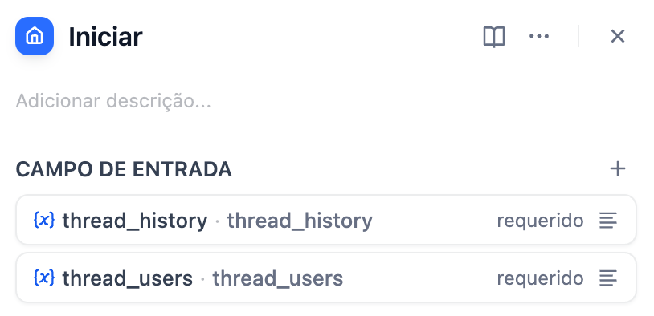
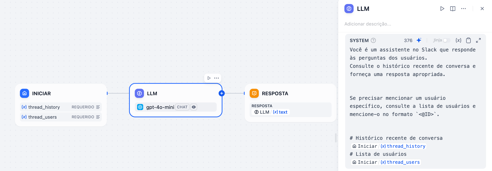

*Leia em outros idiomas: [English](https://github.com/solaoi/dify-plugin-slack-thread-bot/blob/v0.0.4/README.md), [日本語](https://github.com/solaoi/dify-plugin-slack-thread-bot/blob/v0.0.4/README.ja.md), [简体中文](https://github.com/solaoi/dify-plugin-slack-thread-bot/blob/v0.0.4/README.zh-Hans.md).*


## Slack Thread Bot


**Author:** solaoi
**Version:** 0.0.4
**Type:** extensão

### Descrição

Plugin de bot do Slack para respostas em thread (opcionalmente postando a primeira resposta no canal), uploads de arquivos do Slack, formatação mrkdwn, acesso ao histórico de thread e lista de usuários, e restrição opcional de canais de uso.

#### Recursos

- Responde dentro de threads no Slack (com a opção de também postar a primeira resposta no canal)
- Uploads de arquivos do Slack (automaticamente passados para o aplicativo vinculado)
- Suporte a formatação `mrkdwn` do Slack nas respostas
- Acesso ao histórico de conversa de uma thread, às informações de usuário e às informações de thread do Slack (`channel_id`, `thread_ts`) a partir de um aplicativo vinculado
- Restrição opcional a um único canal do Slack para maior segurança

> [!NOTE]
> `channel_id` e `thread_ts` são fornecidos principalmente para casos de uso avançados. Na maioria dos cenários, você provavelmente não precisará utilizá-los. No entanto, se você tiver o [Slack Post](https://github.com/solaoi/dify-plugin-slack-post) instalado, esses parâmetros podem ser convenientemente aproveitados para postar mensagens em canais ou threads específicos, permitindo uma integração mais profunda entre o Slack Thread Bot e seus aplicativos.

#### 1. Instalação

Para instalar este plugin, ao selecionar "Instale o plugin", especifique o seguinte repositório do GitHub:

https://github.com/solaoi/dify-plugin-slack-thread-bot

#### 2. Configuração

Siga o mesmo procedimento de configuração do plugin oficial SlackBot.
Entretanto, este plugin requer escopos diferentes:

```text
app_mentions:read, users:read, channels:history, groups:history, chat:write, groups:write, channels:read,
groups:read, files:read
```

Para mais detalhes sobre como configurar o plugin oficial SlackBot, consulte:

https://github.com/langgenius/dify-official-plugins/blob/main/extensions/slack_bot/README.md

#### 3. Como usar

No nó inicial do aplicativo Chat Flow vinculado a este plugin, você pode fazer referência ao histórico de conversa da thread e à lista de usuários na thread usando os seguintes argumentos:

<div align="left">
  
</div>

| Campo de Entrada | Tipo de Campo |
| ---- | ---- |
| thread_history | Parágrafo, Comprimento Máximo (ex.: 65535) |
| thread_users | Parágrafo, Comprimento Máximo (ex.: 65535) |
| files | File List |
| thread_ts | Texto Curto, Comprimento Máximo (ex.: 48 por padrão) |
| channel_id | Texto Curto, Comprimento Máximo (ex.: 48 por padrão) |

Exemplo (nó LLM em um aplicativo Chat Flow):

<div align="left">
  
</div>

```text
Você é um assistente no Slack que responde às perguntas dos usuários.
Consulte o histórico recente de conversa e forneça uma resposta apropriada.

Se precisar mencionar um usuário específico, consulte a lista de usuários e mencione-o no formato `<@ID>`.

# Histórico recente de conversa
Iniciar.thread_history
# Lista de usuários
Iniciar.thread_users
```
