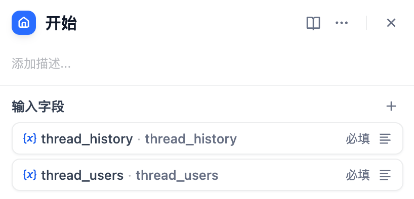
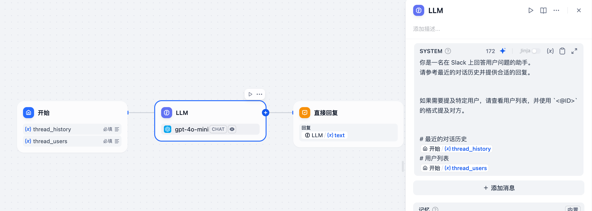

*以其他语言阅读：[English](https://github.com/solaoi/dify-plugin-slack-thread-bot/blob/v0.0.3/README.md)，[日本語](https://github.com/solaoi/dify-plugin-slack-thread-bot/blob/v0.0.3/README.ja.md)，[Português](https://github.com/solaoi/dify-plugin-slack-thread-bot/blob/v0.0.3/README.pt_BR.md)。*


## Slack Thread Bot


**Author:** solaoi
**Version:** 0.0.3
**Type:** 扩展

### 描述

支持线程回复（可选将首次回复发送至频道）、Slack 文件上传、mrkdwn 格式、引用线程历史和用户列表，并可选限制使用频道的 Slack 机器人插件。

#### 功能

- 在 Slack 线程中回复（可选设置同时在频道中发送首条回复）
- Slack 文件上传（自动传递给关联的应用）
- 在回复中支持 Slack `mrkdwn` 格式
- 从关联的应用中访问线程会话历史、用户信息，以及 Slack 线程信息（`channel_id`, `thread_ts`）
- 可选择将使用范围限定至单个 Slack 频道，以实现更安全的使用

> [!NOTE]
> `channel_id` 和 `thread_ts` 主要适用于高级用例。在大多数情况下，您可能不需要使用它们。

#### 1. 安装

要安装此插件，请在选择“安装插件”时指定以下 GitHub 仓库：

https://github.com/solaoi/dify-plugin-slack-thread-bot

#### 2. 设置

按照与官方 SlackBot 插件相同的步骤进行设置。
但需要注意的是，本插件所需的权限范围（scopes）不同：

```text
app_mentions:read, users:read, channels:history, groups:history, chat:write, groups:write, channels:read,
groups:read, files:read
```

有关如何设置官方 SlackBot 插件的详细信息，请参阅：

https://github.com/langgenius/dify-official-plugins/blob/main/extensions/slack_bot/README.md

#### 3. 使用方法

将此插件关联到你的 Chat Flow 应用后，你可以在起始节点中通过以下参数获取线程会话历史和线程用户列表：

<div align="left">
  
</div>

| 输入字段 | 字段类型 |
| ---- | ---- |
| thread_history | 段落，最大长度（如 65535） |
| thread_users | 段落，最大长度（如 65535） |
| files | 文件列表 |
| thread_ts | 文本, 最大长度（如 48，默认） |
| channel_id | 文本, 最大长度（如 48，默认） |

示例（Chat Flow 应用中的 LLM 节点）：

<div align="left">
  
</div>

```text
你是一名在 Slack 上回答用户问题的助手。
请参考最近的对话历史并提供合适的回复。

如果需要提及特定用户，请查看用户列表，并使用 `<@ID>` 的格式提及对方。

# 最近的对话历史
开始.thread_history
# 用户列表
开始.thread_users
```
